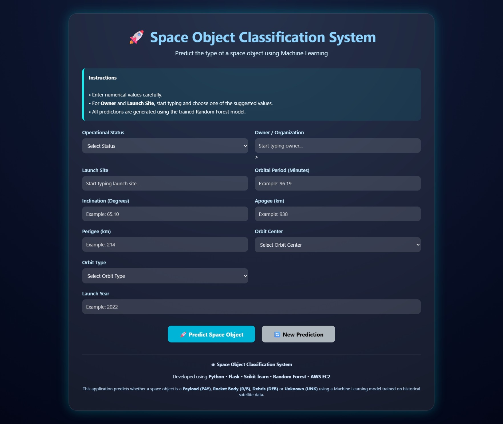
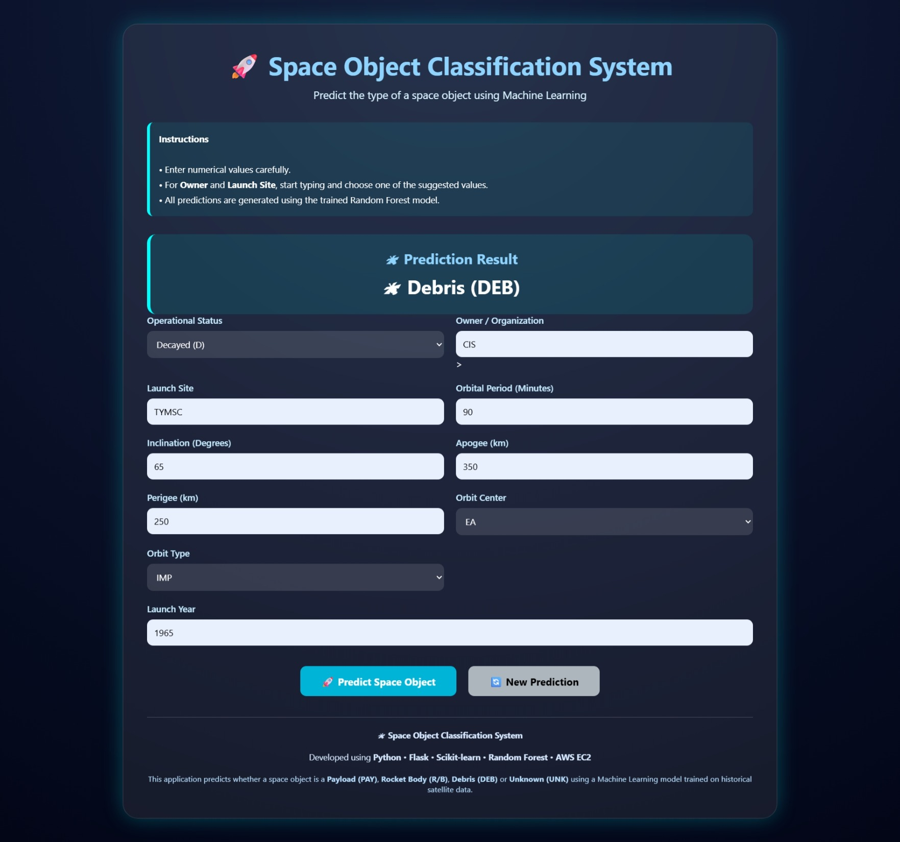

# 🚀 Space Object Classification System using Machine Learning

A Machine Learning-based web application that classifies space objects into different categories using orbital and operational parameters from the **SATCAT (Satellite Catalog)** dataset. The project compares multiple classification algorithms, selects the best-performing model through hyperparameter tuning, and deploys the application using **Flask** on **AWS EC2** for real-time predictions.

---

## 📌 Project Overview

With the rapid increase in satellites, rocket bodies, and space debris, manually identifying space objects has become difficult and time-consuming. This project automates the classification process using Machine Learning, providing faster and more accurate predictions through an interactive web application.

---

## 🎯 Objective

To develop a complete end-to-end Machine Learning system that:

- Classifies space objects into different categories.
- Compares multiple Machine Learning algorithms.
- Selects the best-performing model using hyperparameter tuning.
- Provides real-time predictions through a Flask web application.
- Deploys the application on AWS EC2.

---

## 📂 Dataset

**Dataset:** SATCAT (Satellite Catalog)

**Source:** CelesTrak

The dataset contains information about artificial space objects, including satellites, rocket bodies, payloads, and debris.

### Dataset Summary

- Total Records: **69,420**
- Original Features: **17**
- Selected Input Features: **10**
- Target Variable: **OBJECT_TYPE**

---

## 🎯 Target Classes

The model classifies space objects into four categories:

- PAY (Payload)
- DEB (Debris)
- R/B (Rocket Body)
- UNK (Unknown)

---

## 📥 Final Input Features

The model uses the following features for prediction:

- Operational Status
- Owner
- Launch Site
- Orbital Period
- Inclination
- Apogee
- Perigee
- Orbit Center
- Orbit Type
- Launch Year

---

# ⚙️ Project Workflow

### 1. Data Preprocessing

- Handled missing values.
- Removed unnecessary columns.
- Prepared the dataset for machine learning.

### 2. Feature Engineering

- Extracted **Launch Year** from the Launch Date.

### 3. Exploratory Data Analysis (EDA)

Performed EDA to understand:

- Class distribution
- Feature relationships
- Correlation among numerical features
- Distribution of orbital parameters

### 4. Feature Selection

Selected the most relevant features required for classification.

### 5. Train-Test Split

Split the dataset into training and testing sets for unbiased model evaluation.

### 6. Data Encoding & Preprocessing Pipeline

Implemented a **Scikit-learn ColumnTransformer and Pipeline** to ensure identical preprocessing during both training and prediction.

- One-Hot Encoding for categorical features
- Standard Scaling for numerical features (where required)

### 7. Model Training

The following classification models were trained and compared:

- Logistic Regression
- K-Nearest Neighbors (KNN)
- Support Vector Machine (SVM)
- Decision Tree
- AdaBoost
- Random Forest

### 8. Hyperparameter Tuning

Performed **RandomizedSearchCV** to optimize the Random Forest model.

**Best Parameters:**

- n_estimators = 500
- max_depth = None
- min_samples_split = 10
- min_samples_leaf = 1
- max_features = sqrt

### 9. Model Evaluation

The final model was evaluated using:

- Accuracy
- Precision
- Recall
- F1-Score
- Confusion Matrix

### 10. Flask Web Application

The trained preprocessing pipeline and Random Forest model were integrated into a Flask web application for real-time prediction.

### 11. AWS EC2 Deployment

The Flask application was successfully deployed on an AWS EC2 Linux instance for live demonstration.

---

# 🤖 Machine Learning Models Compared

| Model | Accuracy |
|--------|----------|
| **Random Forest** | **90.76%** |
| K-Nearest Neighbors (KNN) | 88.68% |
| Decision Tree | 88.14% |
| AdaBoost | 78.43% |
| Support Vector Machine (SVM) | 73.20% |
| Logistic Regression | 68.88% |

---

# 🏆 Final Model Performance

| Metric | Score |
|---------|-------|
| Accuracy | **90.76%** |
| Precision | **90.63%** |
| Recall | **90.76%** |
| F1-Score | **90.63%** |

The Random Forest classifier achieved the best overall performance after hyperparameter tuning using **RandomizedSearchCV**. The trained model was serialized using **Pickle** and integrated into a **Flask** web application for real-time space object classification.

---

# 🛠 Technologies Used

### Programming Language

- Python

### Machine Learning & Data Processing

- Scikit-learn
- Pandas
- NumPy

### Data Visualization

- Matplotlib
- Seaborn

### Web Framework

- Flask

### Frontend

- HTML
- CSS

### Deployment

- AWS EC2
- WinSCP
- PuTTY

---

# 📁 Project Structure

```text
Space-Object-Classification-System/
│
├── app.py
├── label_encoder.pkl
├── satcat.csv
├── space_object_classification.ipynb
├── requirements.txt
├── README.md
├── .gitignore
│
├── templates/
│   └── index.html
│
└── Screenshots/
    ├── home_page.jpeg
    └── prediction_result.jpeg
```

---

# 🚀 Installation

Clone the repository:

```bash
git clone https://github.com/Monika1870/Space-Object-Classification-System.git
```

Move into the project directory:

```bash
cd Space-Object-Classification-System
```

Install the required packages:

```bash
pip install -r requirements.txt
```

Run the Flask application:

```bash
python app.py
```

Open your browser and visit:

```text
http://127.0.0.1:5000
```

---


# 📦 Model File

The trained model (`space_object_classifier.pkl`) is **not included** in this repository because its file size exceeds GitHub's upload limit.

To generate the model locally:

1. Open `space_object_classification.ipynb`.
2. Run all notebook cells from start to finish.
3. The notebook will train the Random Forest classifier and automatically generate:
   - `space_object_classifier.pkl`
   - `label_encoder.pkl`

These files are then used by the Flask application for real-time predictions.

---

# 📸 Application Screenshots

### Home Page



### Prediction Result



---

# 🌍 Deployment

The application was successfully deployed on an **AWS EC2 (Amazon Linux)** instance using **Flask**.

### Deployment Environment

- AWS EC2 (Amazon Linux)
- Flask
- WinSCP
- PuTTY

---

# 🔮 Future Improvements

- Retrain the model using updated SATCAT data.
- Include additional orbital parameters.
- Explore Deep Learning models for improved accuracy.
- Integrate satellite tracking and visualization features.
- Develop REST APIs for external applications.

---

# 👩‍💻 Author

**Monika Gautam**

- GitHub: <https://github.com/Monika1870>
- LinkedIn: <https://www.linkedin.com/in/monika-gautam-7b09b0172/>

---

## ⭐ If you found this project useful, consider giving it a star!